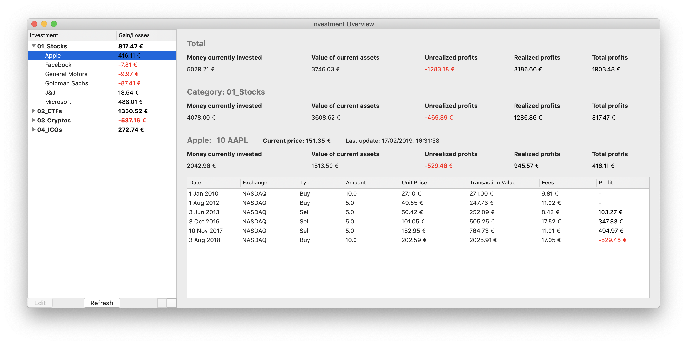

#### InvestmentOverview

## Overview
An application for macOS (written in Swift) that lists and categorises different kinds of investments (stocks, ETFs, cryptos, etc) and calculates the profits of each one of them.

I deployed this application for two main reasons:

1. I noticed that my broker did not keep proper track of my gains & losses so that my tax declaration was a mess and took me forever.
2. Trades on cryptocurrencies were scattered over 10s of different exchanges and it was a nightmare to keep track of them.

This application is a place to keep a detailed overview over gains & losses for different categories of investments.

## Examples

## Features
Transactions are added manually with the following parameters: Name of the investment (has to be unique - e.g. Apple or Bitcoin), investment symbol (e.g. AAPL or BTC) or ISIN, category, number of units bought, price per unit, fees, exchange, date & time.

Based on these transactions and the real-time price data (see below), the following figures are calculated. *All calculations are done using the first-in, first-out accounting system.*

* **Money currently invested:** The money spent on purchasing the assets that are currently still held (including fees).
* **Value of current assets:** The value of the current assets, calculated using the real-time price data.
* **Non-realized profits:** Virtual profits assuming selling the assets now. Difference between *Money currently invested* and *Value of current assets*.
* **Realized profits:** Profits made by selling assets (including fees for buying and selling).
* **Total profits:** Sum of *Non-realized profits* and *Realized profits*

The real-time price of the asset is queried from the following APIs:

* US stocks: [IEX](https://iextrading.com/developer/)
* Stocks, securities, etc traded in Frankfurt, Germany: [Deutsche Börse Group](https://console.developer.deutsche-boerse.com)
* Cryptocurrencies: [CryptoCompare](https://min-api.cryptocompare.com)

## Planned for the future
* Filtering and listing all transactions in a specific date range, with a specific type (e.g. buy, sell, dividends, etc.), or on a specific exchange.
* Listing all transactions relevant for the tax declaration of a given calendar year - Will be implement latest when needed this year.

## Credits
* To everybody who contributed to [SwiftyJSON](https://github.com/SwiftyJSON/SwiftyJSON), which is so useful for dealing with JSON data.
* To everybody who provides free real-time data price data of assets (see above).
* App icon made by [Smashicon](https://www.flaticon.com/authors/smashicons) from [Flaticon](www.flaticon.com)

